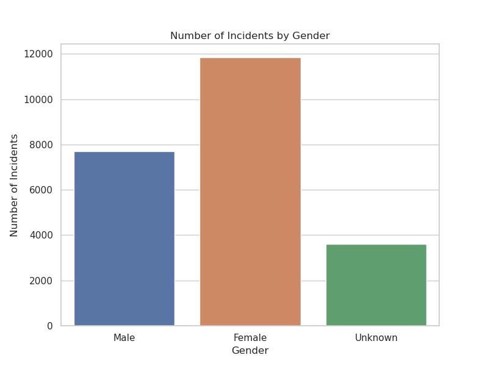
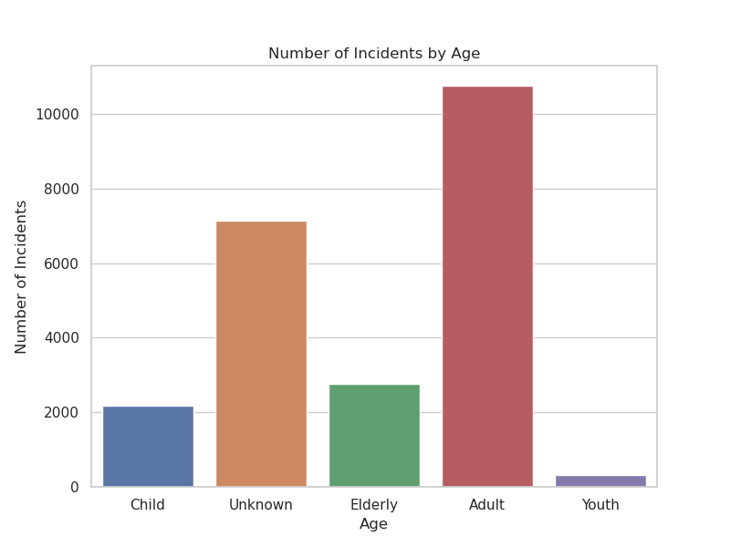
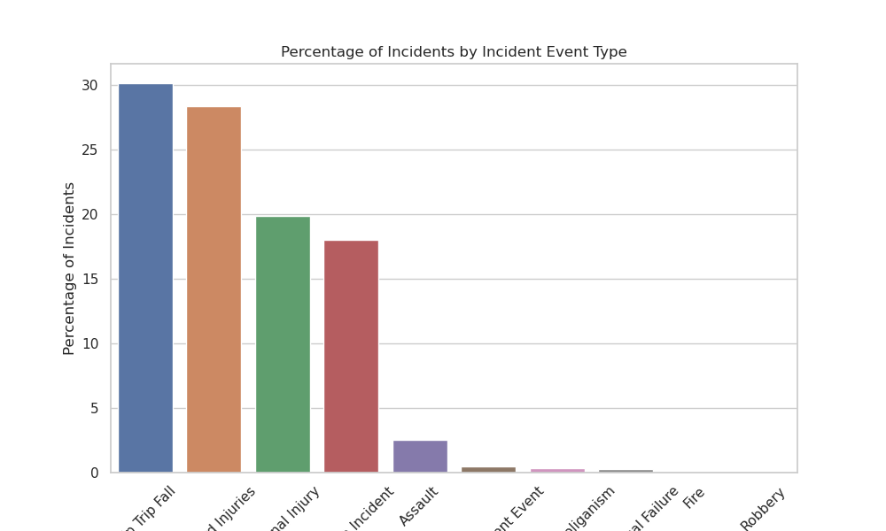

# Risk-Analysis-in-Public-Transport
Analysis of a dataset of traffic incidents using Spark SQL and graphs.

This project is part of the Data Science Academy's Data Scientist Training (https://www.datascienceacademy.com.br/).

Which traffic incidents occur most frequently? What age group is most involved in traffic incidents? What is the most common event in incidents? Are passengers or pedestrians the main victims of incidents?

These and other questions are the focus of analysis in this project, where we provide insights through the examination of publicly available real data (link). In this project, Apache Spark was used to read and process data efficiently, simulating data processing in a distributed cluster of computers. Apache SQL was employed to manipulate and query the data for further analysis. In addition, we leverage the power of Python libraries such as pandas, seaborn, Plotly and Matplotlib to create informative and visually engaging graphs to visualize findings.

For the construction of this project, the dataset available for download at the link below was used:

https://data.world/makeovermonday/2018w51

## Business Questions

The objective of this work is to analyze the data and build graphs that answer the 10 questions below:

1. What is the number of incidents by gender?
2. What age group was most involved in the incidents?
3. What is the percentage of incidents by type of event (Incident Event Type)?
4. How did incidents per month evolve over time?
5. When the incident was “Collision Incident” in which month were there the highest number of incidents involving females?
6. What was the average number of incidents per month involving children (Child)?
7. Considering the incident description as “Injuries treated on scene” (Injury Result Description column), what is the total number of incidents involving males and females?
8. In 2017, in which month were there more incidents with the elderly (Elderly)?
9. Considering the Operator, what is the distribution of incidents over time?
10. What is the most common type of incident with cyclists?

Below are graphs that were obtained in order to answer the first 3 questions:

### 1- What is the number of incidents by gender?

### 2. What age group was most involved in the incidents?

### 3. What is the percentage of incidents by type of event (Incident Event Type)?

